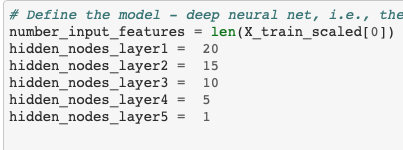
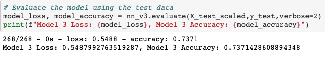

# Neural_Network_Charity_Analysis

## Overview of the analysis: 
The purpose of the analysis is to help the Alphabet Soup's business team predict whether applicants will be successful if funded by Alphabet Soup. Alphabet Soup has donated to more than 34,000 organizations. The Alphabet Soup's business team wants to use the data they have on 34,000 organizations to predict future succucess of applicats.

## Results: 
#### Target
- The variable IS_SUCCESSFUL was used at the target for the model.

#### Features
- Variables APPLICATION_TYPE, AFFILIATION, CLASSIFICATION, USE_CASE, ORGANIZATION, INCOME_AMT, and SPECIAL_CONSIDERATIONS were used as the features for the model.
- Variables NAME, STATUS, and ASK_AMT should be removed from the input data.

#### Compiling, Training, and Evaluating the Model
- There were 5 hidden layers used to provide the highes accurary percentage (0.7371). The first hidden layer has 20 nodes, the seconds hidden layer has 15 nodes, the third hidden layer has 10 nodes, the fourth hidden layer has 5 nodes, and the fifth hidden layer has 1 node. Also, the activation function is sigmoid and epochs is set to 10. There was multiple tests to find what provided the highest accurary percentage. After reducing the noise, using 5 hidden layers, distributing neurons amongst the 5 layers, using sigmoid, and increasing epochs to 10 the highest accuracy percentage acheived is 0.737. It did not meet the target model performance but it did improve from the previous highest accuracy percentage 0.72.

##### Hidden Layers and Nodes

##### Accuracy Percentage

## Summary:
Summarize the overall results of the deep learning model. Include a recommendation for how a different model could solve this classification problem, and explain your recommendation.

Using the instructions from Deliverable 1 and 2 a maximum accuracy of 0.72 was achieved. After making changes to data, adding hidden layers, distributing neurons, and increasing epochs, the accuracy increased to 0.737. The accuracy did not meet the target model performace however, it did improve and any improvement in accuracy is a positive.
